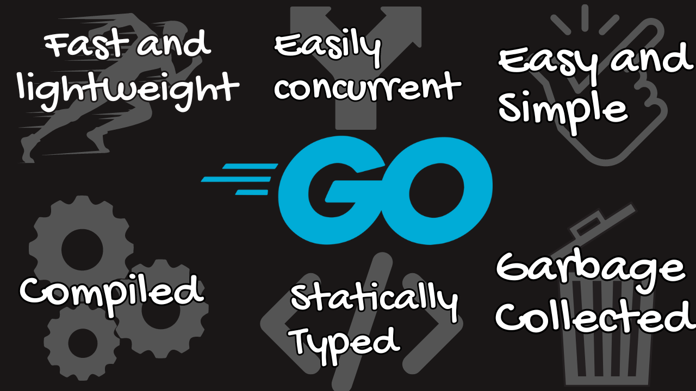

import Quiz from '@site/src/components/Quiz';

# Go Basics

## Why Go?

Go was designed at Google to solve real-world problems in large-scale software development. Here's why it's becoming increasingly popular:



source: [boot.dev](https://www.boot.dev/lessons/73145333-7245-4643-ae6b-e65a5f719906)

**Key benefits of Go:**
- **Simple syntax** - Easy to learn and read
- **Fast compilation** - Compiles in seconds, not minutes
- **Built-in concurrency** - Goroutines make concurrent programming easy
- **Garbage collected** - Automatic memory management
- **Statically typed** - Catch errors at compile time
- **Great tooling** - Formatting, testing, and documentation built-in

## Comments

Go has two kinds of comments. Comments are ignored by the compiler and are used to explain code to other developers (or your future self!).

### Single Line Comments

```go
// This is a single line comment
x := 42 // You can also add comments at the end of a line
```

### Multi-line Comments

```go
/*
    This is a multiline comment.
    It can span multiple lines.
    Neither of these comments will execute as code 
    and will be completely ignored by the compiler.
*/
```

### Best Practices for Comments

```go
package main

import "fmt"

// CalculateArea returns the area of a rectangle
// given its width and height
func CalculateArea(width, height float64) float64 {
    return width * height
}

func main() {
    // Calculate the area of a 5x3 rectangle
    area := CalculateArea(5, 3)
    fmt.Printf("Area: %.2f\n", area)
}
```

:::tip
Good code is self-documenting, but comments should explain **why** something is done, not **what** is being done.
:::

## The Compilation Process

Computers don't understand English or even Go - they understand machine code (0's and 1's). That's what a compiler does: it converts human-readable language into machine-understandable language.

The Go compiler produces machine code - an `.exe` file on Windows or a standard executable on Mac/Linux.


### Example Go Program Structure

```go 
package main

import "fmt"

func main() {
    fmt.Println("Hello World")
}
```

Let's break down each part:

1. **`package main`** - Tells the Go compiler this is a standalone program that can be executed. It's not a library like `package utils` or `package tools`.

2. **`import "fmt"`** - Imports the fmt (formatting) package from the standard library. This allows us to use `fmt.Println` to print to the console.

3. **`func main()`** - Defines the `main` function, the entry point for every Go program.

### Two Kinds of Errors

| Error Type | When it Occurs | Severity |
|------------|----------------|----------|
| **Compilation errors** | When code is compiled | Better - caught before running |
| **Runtime errors** | When program is running | Worse - can crash production |

**Compilation errors** are generally better because they never accidentally make it to production. You can't ship a program with compilation errors because it will never produce the executable file.

**Runtime errors** occur when a program is running. These are generally worse because they can cause the program to crash or, even worse, stop production.

```go title="Compilation Error Example"
package main

func main() {
    x := "hello"
    y := x + 5 // Error: cannot add string and int
}
```

```go title="Runtime Error Example"
package main

func main() {
    var arr [3]int
    fmt.Println(arr[10]) // Runtime panic: index out of range
}
```

## Quiz

<Quiz
  question="Go code generally runs ____ than interpreted languages and compiles ____ than other compiled languages"
  options={[
    "slower, slower",
    "slower, faster",
    "faster, slower",
    "faster, faster"
  ]}
  correctIndex={3}
  explanation="Go runs faster than interpreted languages because it compiles to machine code. It also compiles faster than other compiled languages due to its simple dependency management and efficient compiler design."
/>
